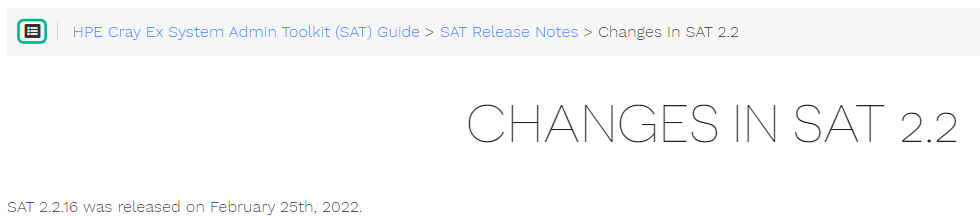
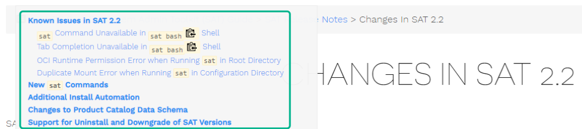
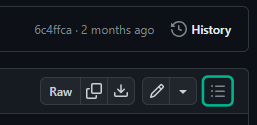
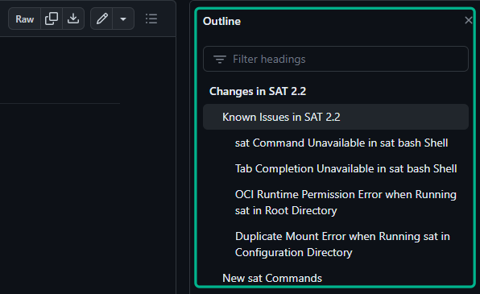

# View SAT Documentation

You can view the System Admin Toolkit (SAT) documentation both online and
offline as described in this section.

## Online Documentation

The SAT documentation can be found online in HTML form at the following link:
[SAT Documentation](https://cray-hpe.github.io/docs-sat). The navigation pane
on the left of the HTML page is ordered alphabetically. You can also navigate
an individual topic's headings by using the **Headings** icon at the top of the
page, as shown in the following images.

The documentation can also be viewed online in GitHub by navigating to the
`docs/` subdirectory of the
[`docs-sat` repository](https://github.com/Cray-HPE/docs-sat/tree/integration).
There you can navigate an individual topic's headings with a similar
**Headings** icon at the top of the page, as shown in the following images.

## Offline Documentation

The SAT documentation is available offline as markdown, which can be
viewed with a markdown viewer or with a text editor. The offline
documentation is available in the `docs/` directory of the SAT release
distribution as well as in RPM package format. The RPM package is
installed as a part of the Ansible plays launched by the Configuration
Framework Service (CFS). Its files are installed to `/usr/share/doc/sat`.
